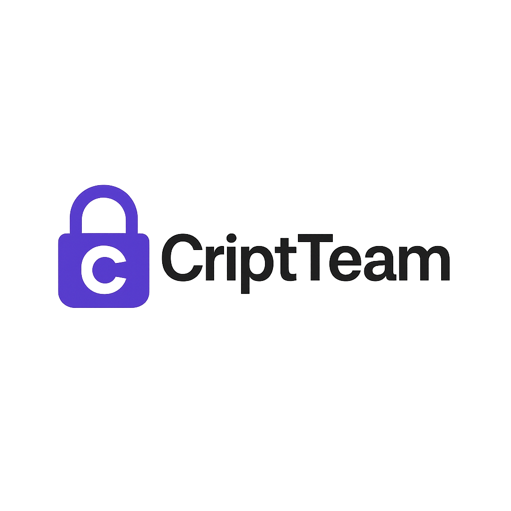

# 🚀 CriptTeam



**CriptTeam** es una aplicación web interactiva y educativa que te invita a descubrir los secretos, curiosidades y la ciencia detrás de la **criptografía**. Explora datos sorprendentes, aprende sobre los grandes hitos en seguridad y diviértete con un diseño moderno y responsivo.  
Ideal para estudiantes, entusiastas de la tecnología y cualquier persona interesada en el fascinante mundo de los códigos y el cifrado.

---

## ✨ Características principales

- 🗝️ **Datos curiosos:** Explora y aprende sobre momentos clave y algoritmos famosos de la criptografía.
- 🔎 **Navegación sencilla:** Encuentra datos organizados y accede rápidamente a cada sección.
- 📱 **Diseño responsive:** Accesible desde cualquier dispositivo, con un estilo limpio y moderno (Tailwind CSS).
- 📄 **Genera PDFs:** Descarga cualquier dato curioso en PDF profesional, con logo y formato atractivo.
- 🔐 **Registro y recuperación segura:** Protección adicional con hashing de contraseñas en el cliente.

---

## 📸 Capturas de pantalla

> _Agrega aquí tus imágenes reales_  
>  
>   
>   

---

## 🚦 Instalación rápida

1. **Clona el repositorio:**
    ```bash
    git clone https://github.com/tuusuario/criptteam.git
    cd criptteam
    ```

2. **Instala dependencias:**
    ```bash
    composer install
    npm install && npm run build
    ```

3. **Copia y configura tu archivo `.env`:**
    ```bash
    cp .env.example .env
    php artisan key:generate
    # Edita el .env para tu base de datos y correo
    ```

4. **Migra y llena la base de datos:**
    ```bash
    php artisan migrate --seed
    ```

5. **Ejecuta la aplicación:**
    ```bash
    php artisan serve
    # O usa Valet/XAMPP/etc.
    ```

6. **¡Listo!** Abre [http://localhost:8000](http://localhost:8000)

---

## ⚙️ Tecnologías usadas

- **Laravel** – backend robusto y seguro
- **Tailwind CSS** – estilos modernos y responsivos
- **Dompdf** – generación de PDFs elegantes
- **CryptoJS** – hashing seguro de contraseñas en el cliente
- **Blade** – motor de vistas elegante de Laravel

---

## 📚 Créditos y agradecimientos

- **CriptTeam** fue creado por [Tu Nombre](https://github.com/tuusuario)
- Íconos por [Flaticon](https://flaticon.com)
- Inspirado por la pasión de aprender y compartir sobre criptografía.

---

## 📝 Licencia

MIT License.  
Si mejoras la app, ¡te invitamos a contribuir! 😃

---

